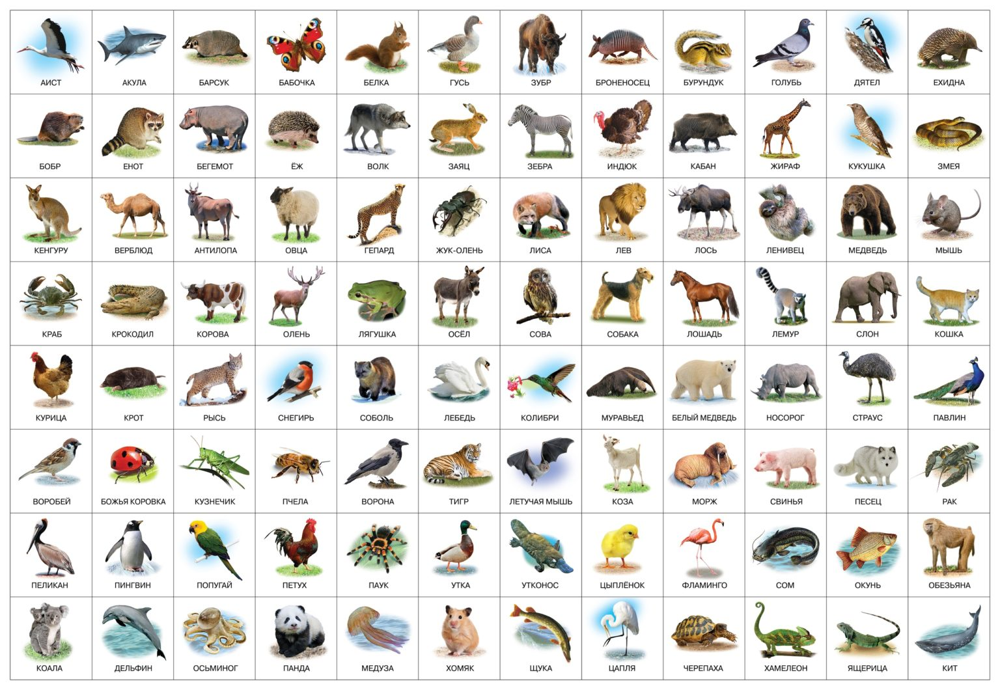
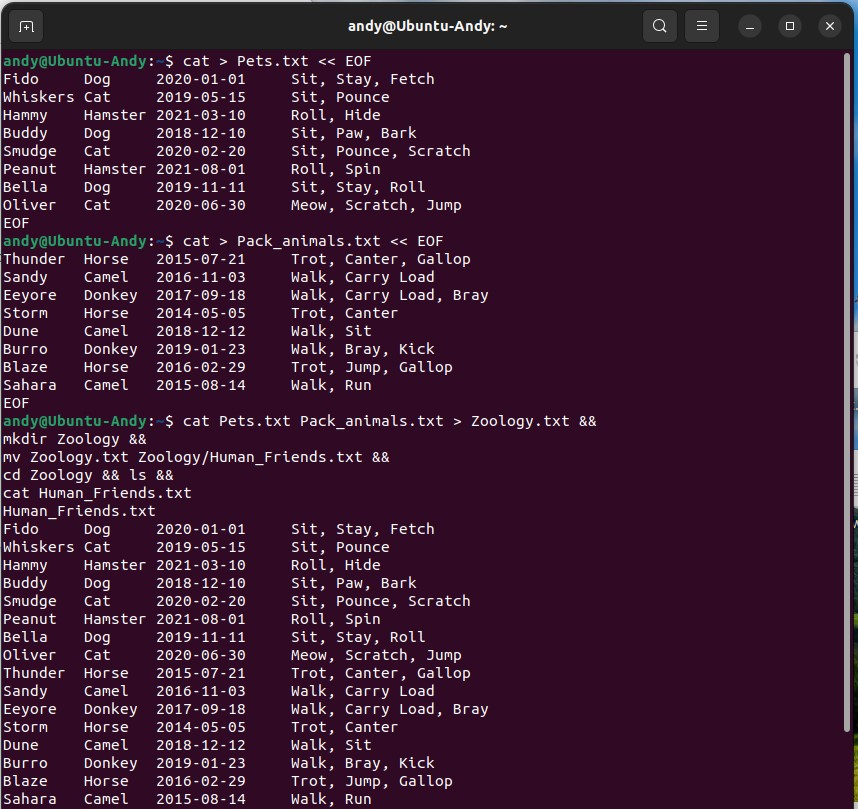
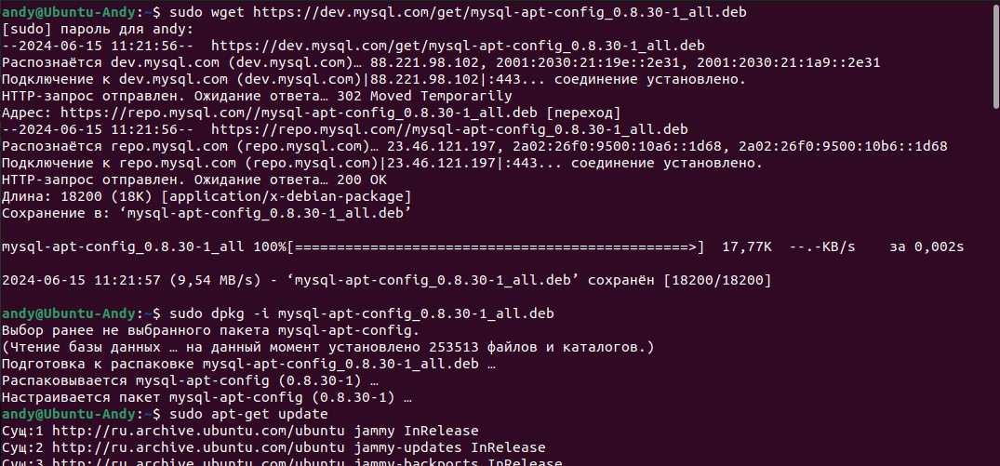
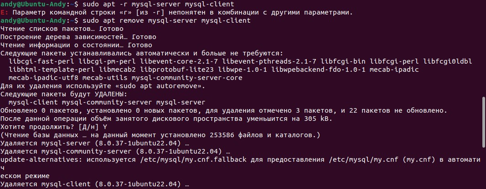
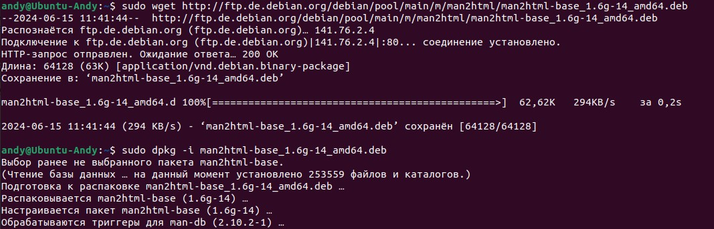
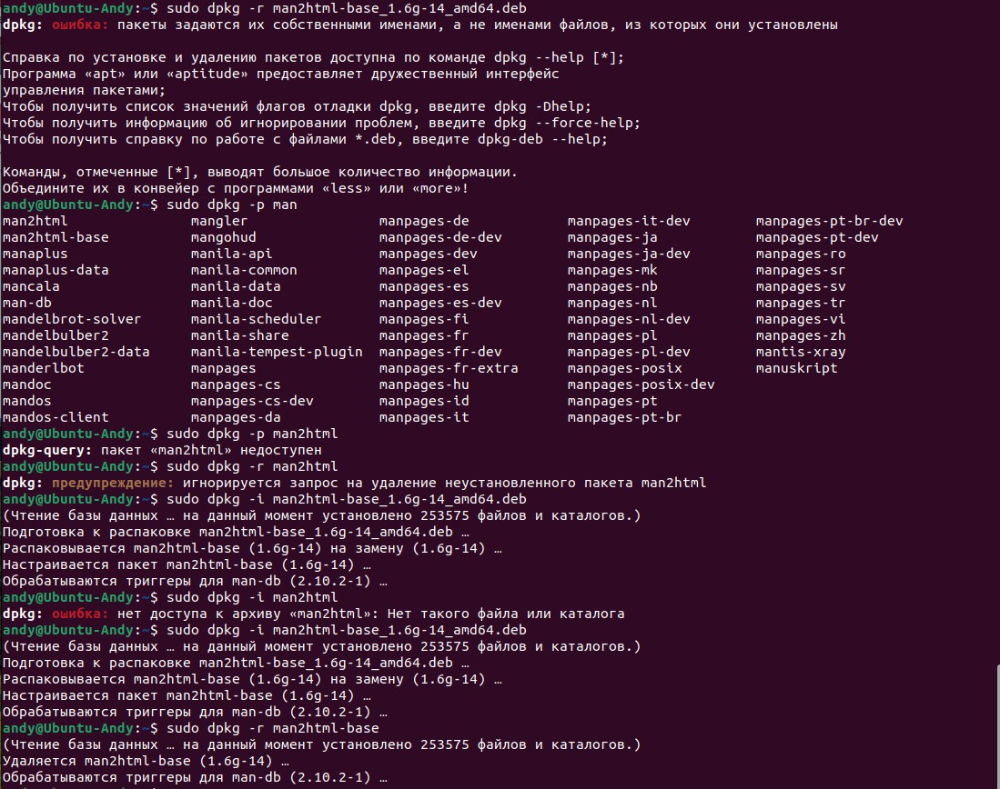
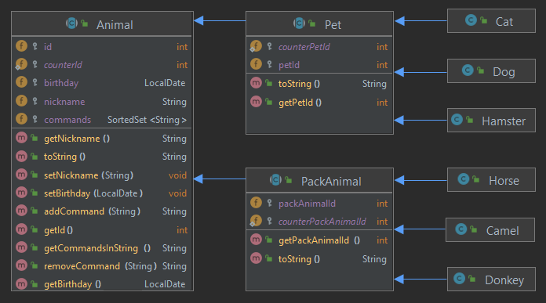
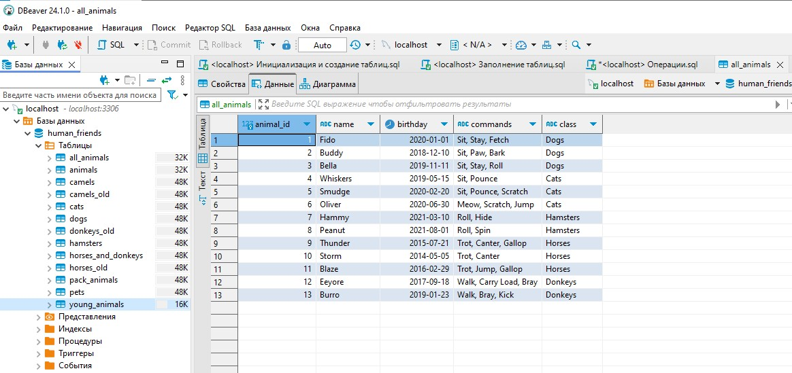

# Итоговая контрольная работа по блоку специализация
Муругов Андрей | Группа 5452: Разработчик | Программист | 25.10.23
(user id 9809325)

Задание:  
Необходимо организовать систему учета для питомника в 
котором живут домашние и Pack animals.

## Операционные системы и виртуализация (Linux)

1. Использование команды cat в Linux

<h6> - Создать два текстовых файла: "Pets"(Домашние животные) и "Pack animals"
 (вьючные животные), используя команду `cat` в терминале Linux. 
В первом файле перечислить собак, кошек и хомяков. Во втором — лошадей, 
верблюдов и ослов.<br>
- Объединить содержимое этих двух файлов в один и просмотреть его содержимое.<br>
- Переименовать получившийся файл в "Human Friends".  </h6>

```bash
cat > Pets.txt << EOF  
Fido     Dog     2020-01-01     Sit, Stay, Fetch  
Whiskers Cat     2019-05-15     Sit, Pounce
Hammy    Hamster 2021-03-10     Roll, Hide  
Buddy    Dog     2018-12-10     Sit, Paw, Bark  
Smudge   Cat     2020-02-20     Sit, Pounce, Scratch  
Peanut   Hamster 2021-08-01     Roll, Spin  
Bella    Dog     2019-11-11     Sit, Stay, Roll  
Oliver   Cat     2020-06-30     Meow, Scratch, Jump  
EOF
```
```bash
cat > Pack_animals.txt << EOF  
Thunder	 Horse	 2015-07-21	Trot, Canter, Gallop  
Sandy	 Camel	 2016-11-03	Walk, Carry Load  
Eeyore	 Donkey	 2017-09-18	Walk, Carry Load, Bray  
Storm	 Horse	 2014-05-05	Trot, Canter  
Dune	 Camel	 2018-12-12	Walk, Sit  
Burro	 Donkey	 2019-01-23	Walk, Bray, Kick  
Blaze	 Horse	 2016-02-29	Trot, Jump, Gallop  
Sahara	 Camel	 2015-08-14	Walk, Run  
EOF  
```

2. Работа с директориями в Linux.  

<h6> - Создать новую директорию и переместить туда файл "Human Friends".</h6>

```bash
cat Pets.txt Pack_animals.txt > Zoology.txt &&
mkdir Zoology &&
mv Zoology.txt Zoology/Human_Friends.txt &&
cd Zoology && ls &&
cat Human_Friends.txt
```

Иллюстрация ввода команд по пунктам 1,2:


3. Работа с MySQL в Linux. Установить MySQL на вашу вычислительную машину.

<h6> - Подключить дополнительный репозиторий MySQL и установить один из пакетов 
из этого репозитория.</h6>

```bash
sudo wget https://dev.mysql.com/get/mysql-apt-config_0.8.30-1_all.deb  
sudo dpkg -i mysql-apt-config_0.8.30-1_all.deb  
sudo apt-get update  
sudo apt-get install mysql-server mysql-client -y  
```

Иллюстрация ввода команд по пункту 3:


Необходимости заворачивать БД в контейнер нет, сразу удаляем приложение.  
Использую MySQL на Windows. Увы.  
Домашка по mysql'у в контейнерзации была, можно было её "сдуть".  
Не вижу принципиальной разницы в терминал "лить" команды или в граф.интерфейс.  


```bash
sudo apt remove mysql-server mysql-client  
```
Иллюстрация ввода команд по пункту 3:


4. Управление deb-пакетами

<h6> - Установить и затем удалить deb-пакет, используя команду `dpkg`.</h6>

Подключаемся к первому попавшемуся под руку репозиторию (конвертер страниц в html, если верно понимаю)
```bash
sudo wget http://ftp.de.debian.org/debian/pool/main/m/man2html/man2html-base_1.6g-14_amd64.deb  
sudo dpkg -i man2html-base_1.6g-14_amd64.deb  
sudo dpkg -r man2html-base
```

Иллюстрация ввода команд по пункту 4:



5. История команд в терминале Ubuntu

<h6> - Сохранить и выложить историю ваших терминальных команд в Ubuntu.</h6>

Реализованно в разделах выше.

## Объектно-ориентированное программирование

6. Диаграмма классов

<h6> - Создать диаграмму классов с родительским классом "Животные", и двумя подклассами:
"Pets" и "Pack animals".<br>
- В составы классов которых в случае Pets войдут классы: собаки, кошки, хомяки, 
а в класс Pack animals войдут: Лошади, верблюды и ослы).<br>
- Каждый тип животных будет характеризоваться (например, имена, даты рождения, 
выполняемые команды и т.д)<br>
- Диаграмму можно нарисовать в любом редакторе, такими как Lucidchart, Draw.io, 
Microsoft Visio и других.</h6>



7. Работа с MySQL (Задача выполняется в случае успешного выполнения задачи 
“Работа с MySQL в Linux. “Установить MySQL на вашу машину”

* <h6>7.1. После создания диаграммы классов в 6 пункте, в 7 пункте база данных
"Human Friends" должна быть структурирована в соответствии с этой диаграммой.
Например, можно создать таблицы, которые будут соответствовать классам "Pets" и 
"Pack animals", и в этих таблицах будут поля, которые характеризуют каждый тип 
животных (например, имена, даты рождения, выполняемые команды и т.д.).</h6>

* <h6>7.2  - В ранее подключенном MySQL создать базу данных с названием "Human Friends".<br>
      - Создать таблицы, соответствующие иерархии из вашей диаграммы классов.<br>
      - Заполнить таблицы данными о животных, их командах и датами рождения.<br>
      - Удалить записи о верблюдах и объединить таблицы лошадей и ослов.<br>
      - Создать новую таблицу для животных в возрасте от 1 до 3 лет и вычислить их возраст 
с точностью до месяца.<br>
      - Объединить все созданные таблицы в одну, сохраняя информацию о принадлежности к 
исходным таблицам.</h6>

Ссылки на запросы:  
[1. Инициализация и создание таблиц](MySQL/Инициализация и создание таблиц.sql)  
[2. Заполнение таблиц](MySQL/Заполнение таблиц.sql)  
[3. Операции](MySQL/Операции.sql)  

Некоторые результаты:


Реализация пунктов:
8. ООП и Java
9. Программа-реестр домашних животных  
   9.1. Добавление нового животного  
   9.2. Список команд животного  
   9.3. Обучение новым командам  
   9.4. Вывести список животных по дате рождения  
   9.5. Навигация по меню  
10. Счетчик животных

представлена по ссылке:  
[Реестр животных](src/main/)

